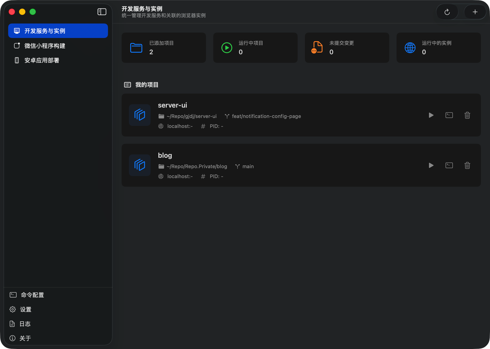
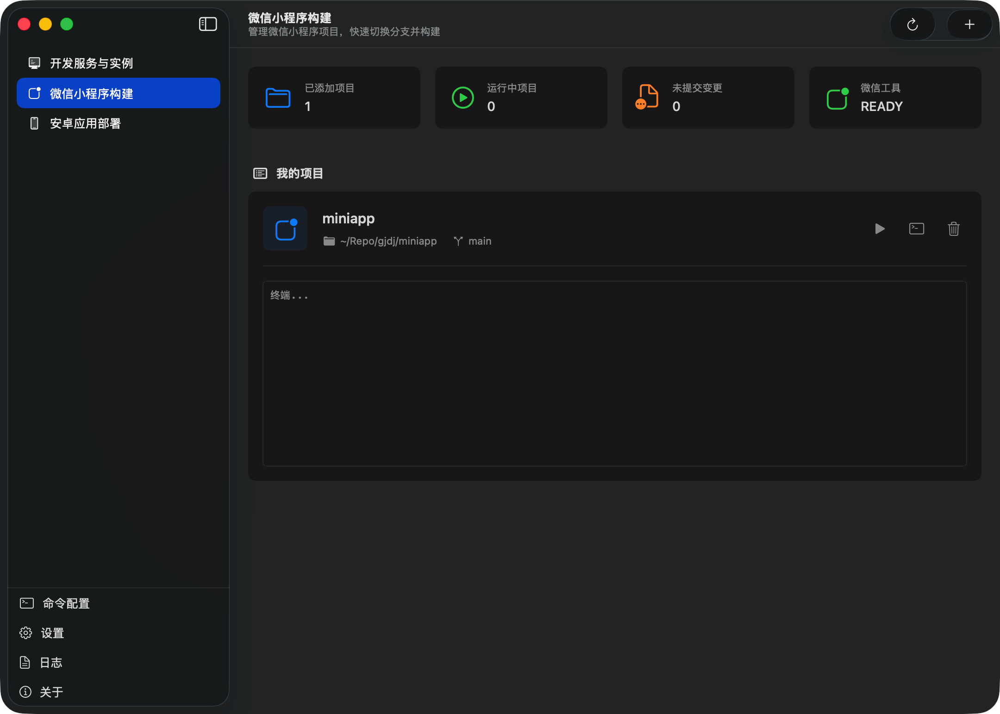
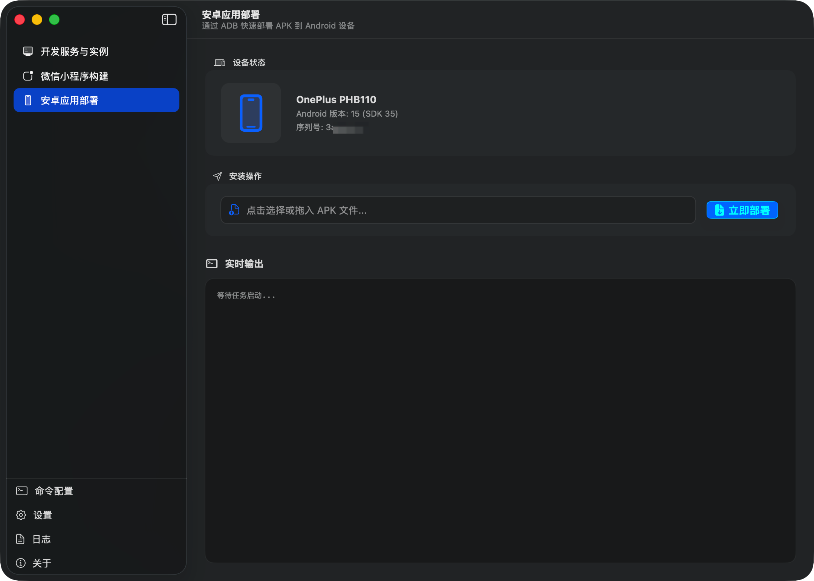

# DevNexus

**把本地开发的那些琐事挪到一个窗口里。**

写前端的时候老在切 terminal 看端口和进程、配 Chrome 调试参数、手动跑小程序构建、ADB 部署重复执行同一套命令——DevNexus 把这些零碎活儿收进一个地方，常用项目加进来之后，启动、切分支、开调试实例、看日志全都能点着做。

<br>

## 它能干什么

### 开发服务与调试

这是 DevNexus 的核心模块，把 **项目管理 + 本地 dev server 探测 + Chrome 调试实例** 三件事捆在一起。

**项目集中管理，Git 状态实时刷新**

把常用项目加进来，每个卡片都能看到当前分支、未提交变更、服务运行状态。切分支直接在界面里选，不用打开 terminal。用的是 FSEvents 监听 `.git` 目录，所以你在外面用别的工具切分支、commit、rebase，DevNexus 这边会自动同步过来，不用手动点刷新。

**本地 dev server 自动发现**

跑着跑着 vite、webpack、rspack、next，隔天就忘了哪个还活着、端口是几。DevNexus 会扫系统里正在监听的开发进程，自动把 server 对应到你加进来的项目上——端口、PID、工作目录一眼看清楚，关进程也不用去翻 `lsof`。扫到的 dev server 会直接挂到对应项目卡片下面，本来要在终端里 `lsof -i` 翻半天的活儿变成一眼就懂。

**独立 Chrome 调试实例**

给某个 dev server 一键开一个带 `--remote-debugging-port` 的 Chrome，每个实例用隔离 profile 目录。好处是：同时调试好几个前端项目不会 cookie/storage 互相污染，每个窗口都可以直接接 [chrome-devtools MCP](https://github.com/ChromeDevTools/chrome-devtools-mcp) 这类外部调试工具。关掉窗口 DevNexus 会自动清理临时 profile 目录，不会堆垃圾。



<br>

### 微信小程序构建

小程序项目的构建节奏和普通 web 不太一样——改完代码要跑一次构建、产物要放到小程序开发者工具里预览、出问题常常要清一次缓存再来一遍。DevNexus 里专门给小程序开了一个模块，保存项目路径、配置构建 / 清理 / 停止命令，一键跑构建、一键清缓存、一键切分支，不用每次都在终端和开发者工具之间反复横跳。

构建过程中的输出会实时流到日志面板，失败时能直接看到报错行，不用等命令执行完再往上翻终端 buffer。



<br>

### 安卓应用部署

面向本地 Android 联调流程：选好 APK、连上设备，一键跑 `adb install` + 日志抓取，部署状态直接在界面里看，不用一直挂一个终端窗口盯着 `adb logcat`。

内置了设备连接检测、安装进度反馈和时间戳校验，避免出现"命令返回成功但其实设备上根本没装上"的假成功情况。日志面板会保留最近几次部署的完整输出，哪次出了问题可以回翻排查。



<br>

### 命令配置与日志

不同项目启动 / 构建 / 清理 / 安装 / 停止的命令都不一样（vite 项目一套、rspack 项目一套、小程序一套）。DevNexus 支持按项目类型存一套模板，加项目的时候直接套用，不用每次新加项目都把相同的 `pnpm dev`、`pnpm build`、`rm -rf node_modules` 重敲一遍。

所有关键操作（启动、停止、构建、部署、切分支）都会落日志，按时间倒序展示，排错可以翻历史。日志支持按分类筛选，不会一堆信息糊一起。

<br>

## 安装

> **系统要求**：macOS 15.0 (Sequoia) 及以上

1. 前往 [Releases](../../releases) 页面，下载最新的 `.dmg` 文件
2. 双击挂载，把 **DevNexus.app** 拖到 Applications 文件夹
3. 由于没有 Apple 公证，首次安装需要在终端执行一下：
   ```bash
   sudo xattr -rd com.apple.quarantine /Applications/DevNexus.app
   ```
4. 打开 DevNexus，菜单栏会出现一个图标，点击或用 `⌘1 / ⌘2 / ⌘3` 快速切到对应模块

<br>

## 从源码构建

**环境要求**

- macOS 15.0+
- Xcode 16+
- 一个 Apple ID（免费账号即可）

**步骤**

1. Clone 仓库
   ```bash
   git clone https://github.com/SlippinDylan/DevNexus.git
   cd DevNexus
   ```

2. 用 Xcode 打开 `DevNexus.xcodeproj`

3. 在 **Signing & Capabilities** 里把 Team 改成你自己的 Apple ID

4. Build & Run

<br>

## 数据位置

应用状态保存在：

```bash
~/Library/Application Support/studio.slippindylan.DevNexus/
```

浏览器调试实例的临时信息保存在：

```bash
~/.devnexus-browsers/
```

<br>

## License

[MIT](LICENSE) © 2025-2026 SlippinDylan Studio
