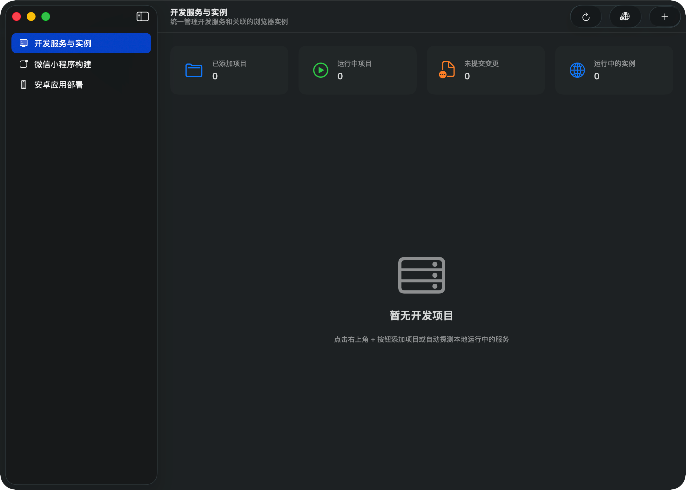
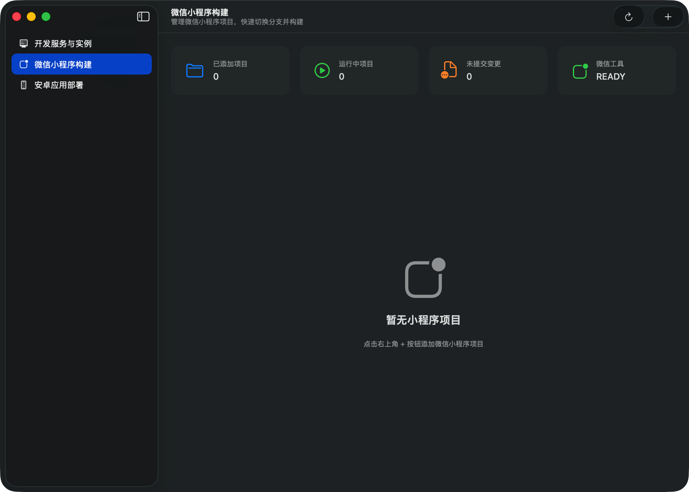
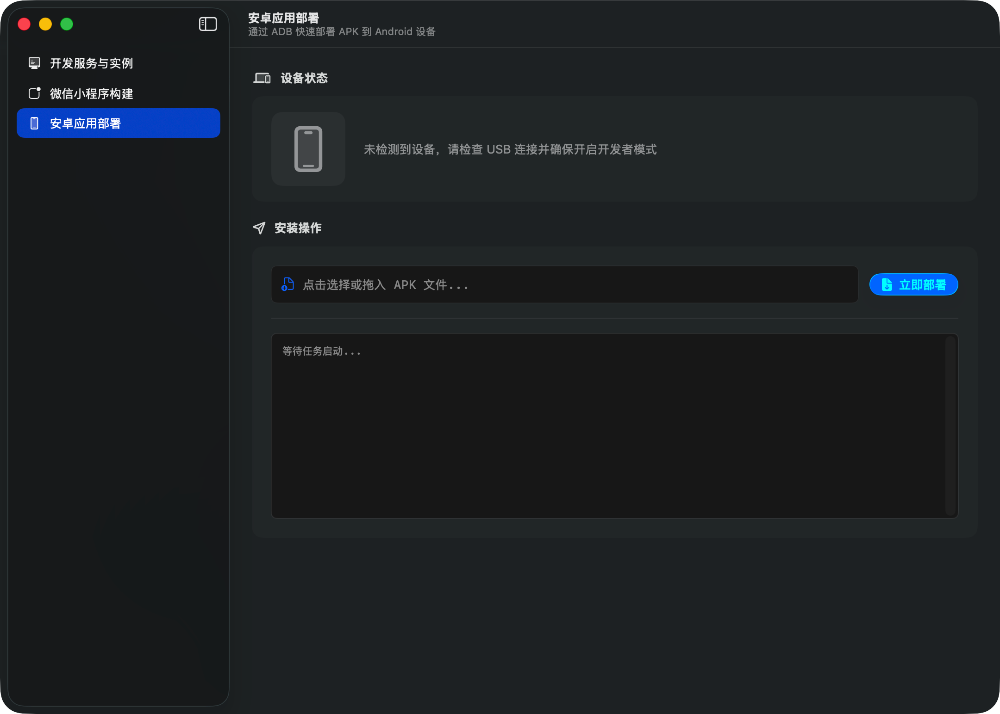

<div align="center">
  
  <h1>Techne</h1>
</div>

---

<div align="center">
  <p>把本地项目、开发服务、微信小程序命令和 Android APK 部署放在一起的原生 macOS 应用。</p>
  <p>
    <strong>简体中文</strong> ·
    <a href="README.zh-TW.md">繁體中文</a> ·
    <a href="../README.md">English</a> ·
    <a href="README.ja.md">日本語</a> ·
    <a href="README.ru.md">Русский</a>
  </p>
</div>

## Techne 能做什么

Techne 适合反复处理同一批本地项目的开发者。项目添加一次后，就能查看 Git 分支和工作区、运行项目自己的命令、查找正在监听的开发服务，或直接为服务打开浏览器。

它还包含两类独立工作流：

- 微信小程序项目可执行你配置的安装依赖、启动、构建、清理和停止命令。
- Android 部署可选择 APK、查找已连接设备、通过 ADB 安装，并显示命令输出。

## 应用内功能

<table>
  <tr>
    <td width="32%">
      <strong>项目、Git 与服务</strong><br><br>
      查看当前分支和未提交文件；工作区干净时可切换分支；按项目配置启动或停止服务。Techne 会查找与 Node、Bun 或 Deno 进程关联的本地监听服务。
    </td>
    <td width="68%"></td>
  </tr>
  <tr>
    <td>
      <strong>微信小程序</strong><br><br>
      命令按项目保存，不绑定某一种构建系统。内置模板提供 npm 和 pnpm 的微信小程序示例。
    </td>
    <td></td>
  </tr>
  <tr>
    <td>
      <strong>Android APK 部署</strong><br><br>
      选择 APK 和已连接的 Android 设备。Techne 读取包名，通过 ADB 重装 APK、核对包更新时间，然后启动应用。
    </td>
    <td></td>
  </tr>
</table>

## 安装

### Homebrew

```bash
brew tap slippindylan/tap
brew trust --tap slippindylan/tap
brew install --cask techne@beta
```

### DMG

从 [Techne Releases](https://github.com/SlippinDylan/Techne/releases) 下载 DMG，打开后将 `Techne.app` 拖到 `Applications`。已发布的 DMG 面向 Apple Silicon Mac。

当前版本使用 Apple Development 证书签名，但未经过 Apple 公证。macOS 因此可能阻止首次打开，或显示无法验证开发者的提示。如果 DMG 来自官方 Releases、应用已移到 `Applications`，且你决定继续使用，可移除下载隔离属性：

```bash
sudo xattr -rd com.apple.quarantine /Applications/Techne.app
```

## 快速开始

1. 打开 Techne，添加本地项目，选择开发服务或微信小程序项目。
2. 选择命令模板，或填入已经能在该项目中运行的命令。Techne 会在项目目录中通过登录 Bash shell 执行它们。
3. Web 项目启动服务后，刷新开发环境，选择已安装的浏览器打开检测到的服务。
4. Android 部署页中连接设备、选择 APK，然后部署。

### 浏览器与独立 profile

Techne 会检测已安装的 Safari、Google Chrome、Chrome Beta、Chromium、Microsoft Edge、Brave 和 Arc。Safari 按普通方式打开地址。Chrome、Chrome Beta、Chromium、Edge、Brave 和 Arc 使用 Chromium 内核：每个受管理实例都有独立 profile、新窗口和远程调试端口，端口从 `9222` 起自动寻找可用值。这样不会复用日常浏览器或其他受管理实例的 cookie 与站点存储。

### 微信小程序命令

Techne 不附带小程序工具链。请先安装项目需要的依赖，再填写能在该仓库运行的命令。内置示例为：

```bash
npm run dev:mp-weixin
npm run build:mp-weixin
pnpm dev:mp-weixin
pnpm build:mp-weixin
```

可以改成项目自己的 npm、pnpm 或其他 shell 命令。相应包管理器和项目工具必须在登录 shell 的 `PATH` 中。

### Android APK 部署

安装 Android SDK Platform-Tools，使 `adb` 在 `PATH` 中可用；连接已开启 USB 调试的 Android 设备；再安装 Android SDK Build Tools。Techne 用 `aapt2` 或 `aapt` 读取 APK 包名，先从 `PATH` 查找，再查找 `~/Library/Android/sdk/build-tools`。

## 系统要求

| 项目 | 要求 |
|---|---|
| macOS | macOS 26 Tahoe 或更高版本 |
| 硬件 | 已发布 DMG 仅支持 Apple Silicon |
| Git 功能 | `git` 在 `PATH` 中，供状态和分支操作使用 |
| 开发服务发现 | macOS 自带的 `lsof`；Techne 扫描 3000–9999 的 TCP 监听端口 |
| 浏览器启动 | 至少安装一个受支持浏览器 |
| 小程序与项目命令 | 项目依赖和命令行工具可在登录 shell 中使用 |
| Android 部署 | `adb`、Android SDK Build Tools（`aapt2` 或 `aapt`）和已开启 USB 调试的设备 |

## 数据位置

项目记录、命令配置和日志存放在：

```bash
~/Library/Application Support/studio.slippindylan.Techne/
```

受管理 Chromium 实例的 profile 和跟踪文件存放在：

```bash
~/.techne-browsers/
```

## 从源码构建

需要 macOS 26 或更高版本，以及 Xcode 26 或更高版本。克隆仓库后，在 Xcode 打开 `Techne.xcodeproj` 并运行 `Techne` scheme；也可以在终端执行：

```bash
git clone https://github.com/SlippinDylan/Techne.git
cd Techne
xcodebuild -project Techne.xcodeproj -scheme Techne -configuration Debug build
```

上面列出的外部工具仅在使用对应功能时需要。

## 许可证

Copyright © 2025–2026 SlippinDylan Studio。Techne 使用 [Apache License 2.0](../LICENSE) 授权。
